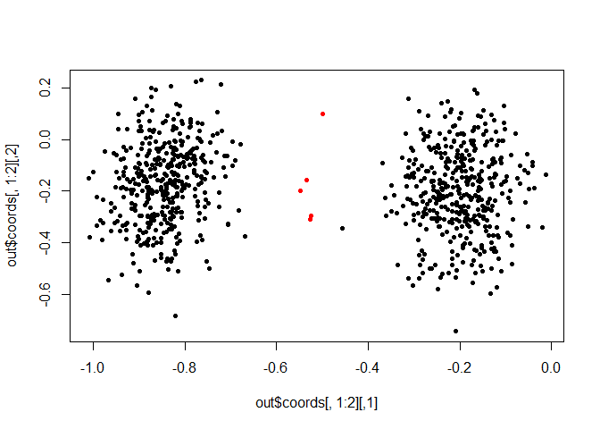

dobin
=====

[](https://travis-ci.org/sevvandi/dobin)

Installation
------------

``` r
# install.packages("devtools")
# devtools::install_github("sevvandi/dobin")
```

Example
-------

A bimodal distribution in six dimensions, with 5 outliers in the middle. We consider 805 observations in six dimensions. Of these 805 observations, 800 observations are non-outliers; 400 observations are centred at (5, 0, 0, 0, 0, 0) and the other 400 centred at ( − 5, 0, 0, 0, 0, 0). The outlier distribution consists of 5 points with mean (0, 0, 0, 0, 0, 0) and standard deviations 0.2 in the first dimension and are similar to other observations in other dimensions.

``` r
library("dobin")
set.seed(1)
# A bimodal distribution in six dimensions, with 5 outliers in the middle.
X <- data.frame(
   x1 = c(rnorm(400,mean=5), rnorm(5, mean=0, sd=0.2), rnorm(400, mean=-5)),
   x2 = rnorm(805),
   x3 = rnorm(805),
   x4 = rnorm(805),
   x5 = rnorm(805),
   x6 = rnorm(805)
)
labs <- c(rep(0,400), rep(1,5), rep(0,400))
out <- dobin(X)
plot(out$coords[ , 1:2], col=as.factor(labs), pch=20)
```


