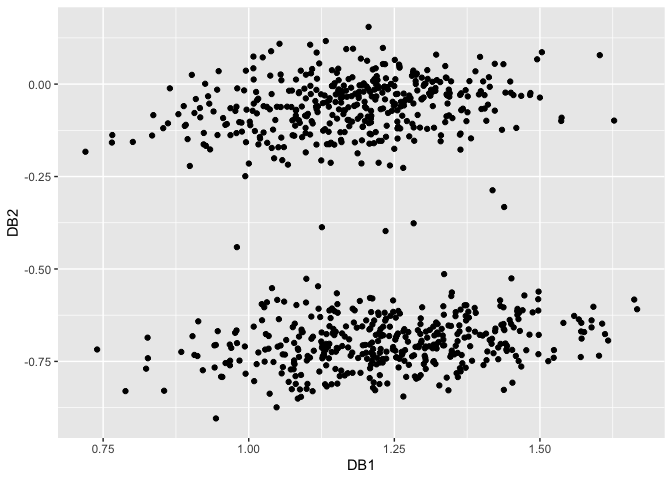
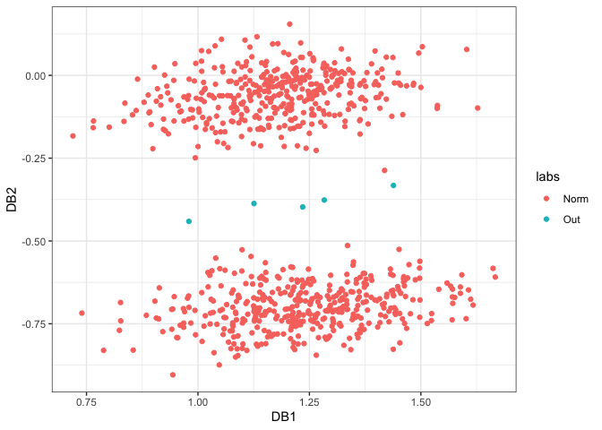
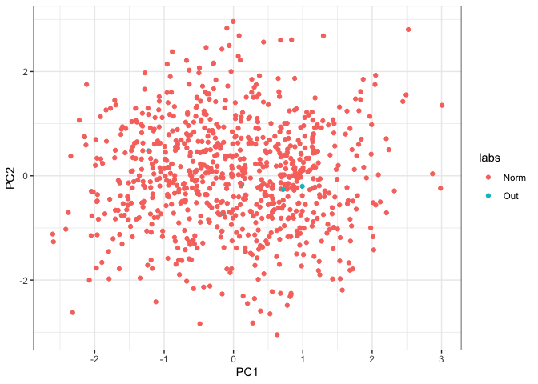

# dobin 

<!-- badges: start -->

[](https://github.com/sevvandi/dobin/actions)
<!-- badges: end -->

[](https://cran.r-project.org/package=dobin)

The R package **dobin** constructs a set of basis vectors tailored for
outlier detection as described in (Kandanaarachchi and Hyndman 2021).
According to Collins English dictionary, “dob in” is an informal verb
meaning to inform against specially to the police. Naming credits goes
to Rob Hyndman.

## Installation

You can install dobin from CRAN:

``` r
 install.packages("dobin")
```

Or you can install the development version from
[GitHub](https://github.com/sevvandi/dobin)

``` r
 install.packages("devtools")
 devtools::install_github("sevvandi/dobin")
```

## Example

A bimodal distribution in six dimensions, with 5 outliers in the middle.
We consider 805 observations in six dimensions. Of these 805
observations, 800 observations are non-outliers; 400 observations are
centred at
")
and the other 400 centred at
").
The outlier distribution consists of

points with mean
")
and standard deviations

in the first dimension and are similar to other observations in other
dimensions.

``` r
library(dobin)
library(ggplot2)

set.seed(1)
# A bimodal distribution in six dimensions, with 5 outliers in the middle.
X <- data.frame(
   x1 = c(rnorm(400,mean=5), rnorm(5, mean=0, sd=0.2), rnorm(400, mean=-5)),
   x2 = rnorm(805),
   x3 = rnorm(805),
   x4 = rnorm(805),
   x5 = rnorm(805),
   x6 = rnorm(805)
)
labs <- c(rep("Norm",400), rep("Out",5), rep("Norm",400))
out <- dobin(X)
autoplot(out)
```

<!-- -->

To see the outliers in a different colour we plot again.

``` r
XX <- cbind.data.frame(out$coords[ ,1:2], as.factor(labs))
colnames(XX) <- c("DB1", "DB2", "labs" )
ggplot(XX, aes(DB1, DB2, color=labs)) + geom_point() + theme_bw()
```

<!-- -->

To compare, we perform PCA on the same dataset. The first two principal
components are shown in the figure below:

``` r
set.seed(1)
# A bimodal distribution in six dimensions, with 5 outliers in the middle.
X <- data.frame(
   x1 = c(rnorm(400,mean=5), rnorm(5, mean=0, sd=0.2), rnorm(400, mean=-5)),
   x2 = rnorm(805),
   x3 = rnorm(805),
   x4 = rnorm(805),
   x5 = rnorm(805),
   x6 = rnorm(805)
)
labs <- c(rep("Norm",400), rep("Out",5), rep("Norm",400))
out <- prcomp(X, scale=TRUE)
XX <- cbind.data.frame(out$x[ ,1:2], as.factor(labs))
colnames(XX) <- c("PC1", "PC2", "labs" )
ggplot(XX, aes(PC1, PC2, color=labs)) + geom_point() + theme_bw()
```

<!-- -->

# References

<div id="refs" class="references csl-bib-body hanging-indent">

<div id="ref-dobin" class="csl-entry">

Kandanaarachchi, Sevvandi, and Rob J. Hyndman. 2021. “Dimension
Reduction for Outlier Detection Using DOBIN.” *Journal of Computational
and Graphical Statistics* 30 (1): 204–19.
<https://doi.org/10.1080/10618600.2020.1807353>.

</div>

</div>
